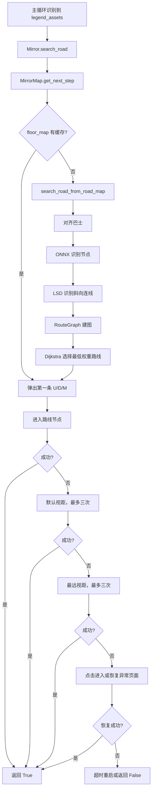

# 旧版本 `search_road` 镜牢寻路流程

## 1. 文档范围

本文描述当前工作区替换前、Git `HEAD` 中的旧版镜牢寻路：

- `tasks/mirror/mirror.py` 的 `Mirror.search_road()`；
- `tasks/mirror/search_road.py` 的 `MirrorMap`；
- ONNX 节点识别与 LSD 连线识别；
- `RouteGraph` 建图与 Dijkstra 路径选择；
- 默认视距、最远视距和返回主界面的多级兜底。

旧实现不是单一算法，而是一条容错链：优先构建完整路线图，失败后依次尝试默认视距最近节点、最远视距节点和异常页面恢复。

## 2. 总体流程



## 3. `Mirror.search_road()` 外层调度

### 3.1 完整路线图优先

入口先调用：

```python
next_node = self.mirror_map.get_next_step(self.flow_watchdog)
```

返回值约定如下：

| 返回值 | 含义 |
| --- | --- |
| `U`、`D`、`M` | 下一步向上、向下或同高度移动 |
| `True` | 构图过程中已经直接进入节点 |
| `False` | 没有缓存，也没有构建出有效路线 |

获得方向后调用 `MirrorMap.enter_next_node()`。成功则记录 watchdog 进展并返回 `True`。ONNX、OpenCV、空数据或坐标异常会被宽泛的 `except Exception` 捕获，然后进入下一层兜底。

### 3.2 默认视距兜底

完整构图失败后调用 `search_road_default_distance()`，最多三次。每次等待截图，寻找巴士，估算上、中、下相邻节点坐标，用特征图片判断节点类型，点击最高优先级节点，再点击“进入”。

如果节点已被选中但“进入”尚未点击，外层会额外尝试一次 `enter_assets.png`。

### 3.3 最远视距兜底

默认视距失败后调用 `search_road_farthest_distance()`，最多三次。它先用滚轮缩小地图，再按固定偏移依次尝试上、中、下节点。

后台点击不支持滚轮，所以外层在 `cfg.background_click=True` 时跳过此阶段；函数自身也会在 `mouse_scroll()` 返回 `False` 时抛出 `InputAttributeError`。

### 3.4 最终恢复

所有寻路方式失败后：

1. 再点击一次“进入”；
2. 循环截图并调用 watchdog；
3. 处理设置页、退出确认和返回窗口页面；
4. 使用 `check_times()` 检查卡死；
5. 超时后调用 `back_init_menu()`。

## 4. `MirrorMap` 路线缓存

### 4.1 状态

| 字段 | 用途 |
| --- | --- |
| `floor` | 当前镜牢楼层 |
| `floor_map` | 未执行方向，如 `[U, M, D]` |
| `floor_nodes` | 路线经过的节点类型 |
| `map` | 按楼层保存路线和节点列表副本 |
| `hard_mode` | 是否应用困难模式建图规则 |

### 4.2 `get_next_step()`

1. `floor_map` 非空时，用 `pop(0)` 取出第一步；
2. 缓存为空时调用 `search_road_from_road_map()`；
3. `(True, True)` 表示构图函数已直接进入节点，向上返回 `True`；
4. 把方向结果转成列表；
5. 复制路线到 `map[f"floor{floor}"]`；
6. 弹出并返回第一步；
7. 无路线时返回 `False`。

旧版在真正点击节点之前就弹出方向；后续点击失败时，该方向已经从缓存移除。

### 4.3 `enter_next_node()`

键盘模式映射：

| 方向 | 按键 |
| --- | --- |
| `U` | `Up` |
| `M` | `Right` |
| `D` | `Down` |

发送方向键后再发送 `Enter`。旧代码即使没识别到“进入”按钮，也直接返回 `True`，可能产生假成功。

坐标模式先匹配巴士，再使用 1440p 基准偏移：

| 方向 | `(dx, dy)` |
| --- | --- |
| `M` | `(500, 50)` |
| `D` | `(500, 450)` |
| `U` | `(500, -400)` |

偏移乘以 `cfg.set_win_size / 1440`。点击节点后等待 1.25 秒，再点击“进入”；失败时还会尝试点击巴士自身。

### 4.4 `refresh_floor()`

楼层改变时更新 `floor` 并清空 `floor_map`，使下一次寻路重新构图。

## 5. 完整路线图构建

核心函数是 `search_road_from_road_map(hard_mode=False, flow_watchdog=None)`。

### 5.1 快速进入

函数首先点击默认视距巴士。如果“进入”可点击，直接返回 `(True, True)`。这是特殊哨兵，不是方向与节点列表。

### 5.2 巴士对齐

不能直接进入时，将巴士尝试移动到 1440p 基准位置：

```text
x ≈ 80
y ≈ 690
```

每轮根据当前位置计算 `dx/dy`，从巴士位置拖动，最多五次。循环中会检查 watchdog、恢复时间和 `check_times()`。

### 5.3 判断巴士所在行

第一次 ONNX 识别后按 Y 分组：

- 两组节点：根据巴士与上方节点关系判定起点是 `TOP` 或 `BOTTOM`；
- 一组节点：通过 LSD 结果快速决定第一步；无线段为 `M`，第一条为 `DOWN` 则是 `D`，否则是 `U`。

巴士被判定在上行或下行时会再次拖动：上行目标 Y 为 `250 × scale`，下行目标 Y 为 `1100 × scale`，目标 X 为 `550 × scale`，之后重新执行 ONNX。

### 5.4 分列与建图

- 节点按 X 坐标分列，容差 80；
- 同列内部按 Y 排序；
- Y 分组容差 20；
- LSD 连线也按 X 分到相邻列之间；
- 创建 `RouteGraph`，先加入水平边，再按 LSD 结果加入斜向边；
- 用 Dijkstra 计算最低总代价路线。

成功返回 `(方向列表, 节点类型列表)`，失败返回 `([], [])` 或 `(False, [])`。

## 6. ONNX 节点识别

`identify_nodes(bus_x)` 使用 `assets/model/best.onnx` 检测：

| 类别 | 含义 |
| --- | --- |
| `battle` | 普通战斗 |
| `boss_battle` | Boss 战 |
| `event` | 事件 |
| `hard_battle` | 集中遭遇战 |
| `hard_battle_2` | 精锐遭遇战 |
| `shop` | 商店 |
| `small_boss_battle` | 异想体遭遇战 |

识别步骤：

1. 获取彩色截图；
2. 用最长边创建正方形黑底图，截图贴在左上角；
3. 缩放到 `640 × 640`，像素除以 255 并交换 RGB；
4. 运行 ONNX Runtime；
5. 丢弃最大类别分数低于 0.25 的框；
6. 用 `NMSBoxes` 做非极大值抑制，NMS 阈值 0.4；
7. 把框中心还原到原截图坐标；
8. 丢弃巴士左侧或太接近巴士的节点；
9. 返回 `[[类别, (中心X, 中心Y)], ...]`。

旧版每次调用都会重新创建 `InferenceSession`，没有缓存模型会话。

## 7. LSD 连线识别

`identify_road(bus_x, min_length=160, merge_distance=230)` 使用 OpenCV Line Segment Detector：

1. 获取截图并提取线段；
2. 计算每条线的长度、中心、斜率和 0～180 度角度；
3. 保留 30～60 度和 120～150 度两类对角线；
4. 同方向线段按长度降序；
5. 根据斜率差和中心距离进行聚类；
6. 对聚类端点进行线性拟合；
7. 丢弃合并后短于 `min_length × scale` 的线；
8. 将 45 度转换为 `DOWN`，135 度转换为 `UP`；
9. 丢弃巴士左侧连线并返回方向与中心坐标。

ONNX 与 LSD 分别截图，地图动画或拖动未稳定时可能产生节点和连线错帧。

## 8. `RouteGraph`

### 8.1 三行模型

每列固定包含 `TOP`、`MID`、`BOTTOM` 三个位置。节点相对中线偏移超过阈值时归到上行或下行，否则归到中行。未识别位置使用 `DEFAULT_WEIGHT=999`。

### 8.2 完整路线图权重

权重越低越优先：

| 节点 | 权重 |
| --- | ---: |
| 商店、Boss | 1 |
| 事件 | 18 |
| 普通战斗 | 30 |
| 集中遭遇战 | 75 |
| 精锐遭遇战 | 100 |
| 异想体战斗、未识别 | 999 |

同一行的相邻有效节点直接建立水平边；LSD 的 `UP/DOWN` 用来建立斜向边。困难模式只处理前两组连线。普通模式缺少商店或 Boss 时，会在末尾补充中行商店和中行 Boss。

### 8.3 Dijkstra

起点是 `layer1` 中巴士所在位置。算法优先寻找任意 Boss；没有 Boss 时，选择最大不超过第三层的目标层。总代价是沿途节点权重之和。最后比较相邻节点的三行位置，将路径转换为 `U/D/M`。

## 9. 默认视距算法

`search_road_default_distance()` 不建完整图，只判断巴士附近三个节点。特征分数越高越优先：

| 节点 | 分数 |
| --- | ---: |
| 商店、事件 | 3 |
| 普通战斗 | 2 |
| 集中遭遇战 | 1 |
| 精锐遭遇战 | 0 |
| 未识别 | -5 |
| 巴士自身 | -6 |

函数先检查中、下节点，有分数 3 时立即进入；否则把巴士拖到 Y≈650，再比较上、中、下和巴士自身，按分数降序尝试。

## 10. 最远视距算法

`search_road_farthest_distance()` 先缩小地图，寻找最大视距巴士。1440p 基准候选偏移为：

```text
上：(250, -200)
中：(250, 0)
下：(250, 225)
```

按上、中、下顺序尝试，最后点击巴士自身。该逻辑依赖滚轮，后台点击和部分模拟器输入后端不可用。

## 11. Watchdog 与超时

旧寻路在巴士对齐、截图等待、默认视距调整、最远视距和最终恢复中调用 `flow_watchdog.check()`。同时又使用 `check_times()` 做局部超时，并通过 `auto.get_restore_time()` 排除游戏恢复所花时间。因此旧实现同时存在流程 watchdog 和局部计时两套机制。

## 12. 已知风险

1. 进入节点前就弹出缓存方向，点击失败会丢步骤。
2. 键盘模式可能没有真正进入却返回 `True`。
3. ONNX 和 LSD 使用不同截图，可能错帧。
4. ONNX 每次重新加载模型，增加延迟。
5. 从巴士节点开始拖动，部分输入后端可能把滑动识别成节点交互。
6. 多处依赖固定像素偏移，对缩放和布局变化敏感。
7. 默认视距和完整路线图使用两套不同权重。
8. 最远视距依赖滚轮，后台模式通常不可用。
9. 巴士、节点或连线为空时，部分路径依赖外层异常捕获兜底。
10. 多级兜底可能把输入未生效误判成成功，使主循环继续停在路线图。

## 13. 返回值汇总

| 函数 | 成功 | 失败 |
| --- | --- | --- |
| `Mirror.search_road()` | `True` | `False` 或结束恢复循环 |
| `MirrorMap.get_next_step()` | `U/D/M` 或 `True` | `False` |
| `MirrorMap.enter_next_node()` | `True` | `False` |
| `search_road_from_road_map()` | `(方向列表, 节点列表)` 或 `(True, True)` | `([], [])`、`(False, [])` |
| `search_road_default_distance()` | `True` | `False` |
| `search_road_farthest_distance()` | `True` | `False` 或 `InputAttributeError` |
| `identify_nodes()` | 节点列表 | `None` |
| `identify_road()` | 连线列表 | 空列表 |
| `find_min_weight_route()` | `(总代价, Node路径)` | `(inf, [])` |

## 14. 总结

旧版的核心是“ONNX 识别节点 + LSD 识别连线 + 三行 RouteGraph + Dijkstra 选低代价路线”。完整构图失败后，再用固定坐标、节点特征、滚轮缩放和异常页面恢复逐级兜底。
