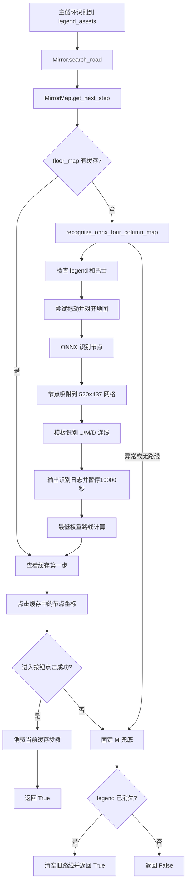

# 新版本 `search_road` 镜牢寻路流程

## 1. 文档范围

本文描述当前工作区中的新版本镜牢寻路，主要涉及：

- `tasks/mirror/mirror.py` 中的 `Mirror.search_road()`；
- `tasks/mirror/search_road.py` 中的四列 ONNX 构图；
- 固定网格、连线模板和最低权重路线；
- `MirrorMap` 路线缓存；
- 固定选择 `M` 的默认兜底。

新版本已经移除旧版的 LSD 连线识别、三行 `RouteGraph`、默认视距特征权重、滚轮最远视距和返回主界面的寻路恢复循环。

本文按当前代码真实行为编写，其中包括用于调试的 `sleep(10000)`。

## 2. 总体流程



## 3. 实际调用入口

`Mirror.search_road()` 是新寻路的外层入口。

### 3.1 ONNX 路线优先

```python
next_node = self.mirror_map.get_next_step(self.flow_watchdog)
```

如果获得 `U`、`M` 或 `D`，调用：

```python
self.mirror_map.enter_next_node(next_node)
```

进入成功后记录：

```text
按ONNX路径进入镜牢节点
```

然后返回 `True`。

### 3.2 固定 M 兜底

下列情况会进入默认 M：

- ONNX 截图失败；
- 未找到 `legend_assets`；
- 未找到巴士；
- 拖动后找不到巴士；
- ONNX 或 OpenCV 抛出异常；
- 没有可达路线；
- 点击 ONNX 节点后没找到“进入”按钮。

兜底调用：

```python
enter_default_middle_path(self.mirror_map.bus_position)
```

成功后清空 ONNX 路线缓存，避免已经走了 M，却继续使用原计划中的旧方向。

## 4. ONNX 什么时候执行

`MirrorMap.get_next_step()` 先检查 `floor_map`：

```python
if self.floor_map:
    return self.floor_map[0]
```

只有缓存为空时才调用 `recognize_onnx_four_column_map()`。因此 ONNX 在以下情况执行：

1. 第一次进入当前楼层路径图；
2. `refresh_floor()` 检测到楼层变化并清空缓存；
3. 当前缓存路线全部走完；
4. 默认 M 成功后调用 `clear_route()`；
5. 代码主动清空路线。

缓存仍有方向时，不重新截图、拖动或运行 ONNX。

## 5. 四列地图识别

核心函数：

```python
recognize_onnx_four_column_map(connection_threshold=0.85)
```

该函数只构建地图，不负责点击节点。

### 5.1 页面和巴士检查

1. 获取灰度截图；
2. 用 `legend_assets.png` 确认当前是镜牢路线图；
3. 用 `mybus_default_distance.png` 定位巴士；
4. 任一步失败都抛出 `RuntimeError`，由外层切换到固定 M。

### 5.2 当前拖动逻辑

当前代码先等待 1 秒，然后从巴士节点本身开始拖动：

```python
dx = 120 * scale - bus_x
dy = 200 * scale
```

目标是将巴士横向靠左，并增加纵向偏移。拖动后重新截图并再次定位巴士。

注意：输入实现中正数 `dy` 表示向下拖动。当前代码注释写“纵向移动”，但它不是负方向的上拖。

### 5.3 ONNX 节点检测

`identify_nodes()` 使用：

```text
assets/model/best.onnx
```

识别类别如下：

| 类别 | 含义 |
| --- | --- |
| `battle` | 普通战斗 |
| `boss_battle` | Boss 战 |
| `event` | 事件 |
| `hard_battle` | 集中遭遇战 |
| `hard_battle_2` | 精锐遭遇战 |
| `shop` | 商店 |
| `small_boss_battle` | 异想体遭遇战 |

推理过程：

1. 彩色截图扩展为正方形；
2. 缩放到 `640×640`；
3. 像素归一化并交换 RGB；
4. 执行 ONNX Runtime；
5. 丢弃最高类别置信度低于 0.25 的框；
6. 使用 NMS，重叠阈值为 0.4；
7. 还原节点中心坐标；
8. 丢弃巴士左侧或距离巴士太近的检测框。

当前每次识别都会重新创建 `InferenceSession`，没有缓存 ONNX 会话。

## 6. 固定四列网格

新版本不再按检测结果动态分列，而是使用固定几何关系：

```python
FOUR_COLUMN_NODE_X_GAP = 520
FOUR_COLUMN_NODE_Y_GAP = 437
FOUR_COLUMN_COUNT = 4
```

实际间距乘以：

```python
scale = cfg.set_win_size / 1440
```

以巴士为 `(0, 0)`：

```text
column = round((node_x - bus_x) / x_gap)
row    = round((node_y - bus_y) / y_gap)
```

行编号定义：

| 行号 | 位置 |
| ---: | --- |
| `-1` | 巴士上方一行 |
| `0` | 与巴士同高 |
| `1` | 巴士下方一行 |

节点必须位于第 1～4 列，且与理论网格位置的 X/Y 偏差都不能超过 `130 × scale`。不满足条件的 ONNX 节点会被丢弃。

巴士自身保存为：

```python
(0, 0): {"type": "bus", "position": bus_position}
```

## 7. 连线识别

新版本不使用 LSD，而是使用三个灰度模板：

| 方向 | 模板 |
| --- | --- |
| `U` | `up.png` |
| `M` | `mid.png` |
| `D` | `down.png` |

对于每个节点，只检查下一列的三个候选位置：

```text
当前行 - 1：U
当前行：M
当前行 + 1：D
```

识别区域位于两个节点的中点附近：

```text
横向搜索半径：150 × scale
纵向搜索半径：120 × scale
```

使用 `cv2.matchTemplate(..., TM_CCOEFF_NORMED)`。最高相似度达到默认阈值 0.85 时，加入一条边：

```python
{
    "source": (源列, 源行),
    "target": (目标列, 目标行),
    "direction": "U/M/D",
    "score": 相似度,
}
```

## 8. ONNX 输出与调试暂停

每次完整识别会输出三类日志：

```text
ONNX 原始节点识别结果
ONNX 四列网格节点
ONNX 路径连线
```

随后执行：

```python
sleep(10000)
```

因此每次重新触发 ONNX 都会暂停 10000 秒，约 2 小时 46 分钟。使用缓存路线时不会执行该暂停。

该暂停是当前调试行为，不是正常寻路所必需。

## 9. 最低权重路线

`build_route_from_four_column_map()` 用邻接表和优先队列计算最低代价路径。

节点权重：

| 节点 | 权重 |
| --- | ---: |
| 商店、Boss | 1 |
| 事件 | 18 |
| 普通战斗 | 30 |
| 集中遭遇战 | 75 |
| 精锐遭遇战 | 100 |
| 异想体战斗、未知节点 | 999 |

目标选择规则：

1. 如果识别结果中存在可达 Boss，选择总代价最低的 Boss；
2. 如果没有 Boss，寻找最远可达列；
3. 在最远列中选择总代价最低的节点；
4. 回溯得到节点路径；
5. 将每条边转换成 `U/M/D`；
6. 同时返回沿途节点类型。

新版本不会像旧版那样自动补虚拟商店和虚拟 Boss。如果 ONNX 只能看到四列普通节点，路线只规划到最远可达的第四列；缓存走完后，从新的巴士位置重新识别。

## 10. `MirrorMap` 路线缓存

### 10.1 字段

| 字段 | 用途 |
| --- | --- |
| `floor` | 当前楼层 |
| `floor_map` | 尚未执行的 `U/M/D` |
| `floor_nodes` | 路线节点类型 |
| `floor_positions` | 每一步对应的实际屏幕坐标 |
| `bus_position` | 构图时的巴士坐标 |
| `map` | 当前楼层路线与节点类型副本 |

### 10.2 构建坐标缓存

得到方向后，以巴士行为 0，逐步更新行号：

```text
U：row -= 1
M：row 不变
D：row += 1
```

然后从网格节点字典中读取 `(column, row)` 的实际 ONNX 坐标，保存进 `floor_positions`。

### 10.3 步骤消费规则

`get_next_step()` 只查看：

```python
return self.floor_map[0]
```

不会提前弹出方向。`enter_next_node()` 执行：

1. 检查方向是否等于缓存第一项；
2. 点击 `floor_positions[0]`；
3. 等待 0.75 秒；
4. 图片匹配并点击“进入”按钮；
5. 点击失败时返回 `False`，不消费缓存；
6. 点击成功后同时弹出方向、节点类型和坐标；
7. 返回 `True`。

这避免了旧版“点击失败但路线已经被消费”的问题。

### 10.4 缓存清理

`clear_route()` 清空方向、节点、坐标和巴士位置。

`refresh_floor()` 只有在楼层变化时调用 `clear_route()`。固定 M 兜底成功后也会清空路线，因为实际位置已经偏离原 ONNX 计划。

## 11. 固定 M 默认路径

`enter_default_middle_path(bus_position=None)` 不执行 ONNX，也不识别节点类型。

如果有巴士坐标，目标为：

```python
target_x = bus_x + 520 * scale
target_y = bus_y
```

如果没有巴士坐标，使用默认巴士位置：

```python
bus_position = (120 * scale, 675 * scale)
```

随后：

1. 点击目标坐标；
2. 等待 0.75 秒；
3. 发送 `Enter`；
4. 等待 1.25 秒；
5. 重新截图；
6. 如果还能识别到 `legend_assets`，认为没有离开路线图，返回 `False`；
7. `legend_assets` 消失则返回 `True`。

默认 M 不匹配节点图片，但会用 `legend_assets` 验证是否进入成功。

## 12. Watchdog 行为

`MirrorMap.get_next_step()` 仍保留 `flow_watchdog` 参数，但当前实现没有在 ONNX 截图、拖动或识别过程中调用 `flow_watchdog.check()`。

寻路成功后，`Mirror.search_road()` 会调用：

```python
self.flow_watchdog.progress(...)
```

因此新实现目前只上报成功进展，不在寻路内部主动执行 watchdog 超时恢复。

## 13. 中途启动

中途启动时，当前巴士被当作新的 `(0, 0)`。ONNX 只保留巴士右侧节点，再按相对列和相对行构图。

例如从原地图第二列启动：

```text
原第二列当前巴士 → 新的第0列
原第三列         → 新的第1列
原第四列         → 新的第2列
```

新版本不关心原始绝对列编号，也不会补商店和 Boss。它走完当前可见路线后，再从新的当前位置重新识别。

## 14. 当前已知限制

1. 拖动从可交互的巴士节点开始，部分输入后端可能不移动地图。
2. 当前不比较拖动前后巴士坐标，拖动失败后仍继续识别。
3. `dy=200×scale` 是向下拖动，不是负方向上拖。
4. 没有根据巴士处于第一行或第三行自适应调整纵向位置，可能看不到最远一行。
5. 固定最多四列，超出四列的节点会被网格过滤。
6. 不自动补商店和 Boss。
7. 每次 ONNX 都重新加载模型会话。
8. 连线依赖 `up.png`、`mid.png`、`down.png`，模板或阈值不匹配时会断边。
9. `sleep(10000)` 会让每次 ONNX 识别暂停约 2 小时 46 分钟。
10. ONNX 内部没有 watchdog 检查。
11. 默认 M 的无巴士坐标位置是假定值，地图未按预期对齐时可能点偏。

## 15. 返回值汇总

| 函数 | 成功结果 | 失败结果 |
| --- | --- | --- |
| `Mirror.search_road()` | `True` | `False` |
| `recognize_onnx_four_column_map()` | 路径图字典 | 抛出异常 |
| `identify_nodes()` | 节点列表 | 抛出异常或空列表 |
| `build_route_from_four_column_map()` | `(方向列表, 节点列表)` | `([], [])` |
| `MirrorMap.get_next_step()` | `U/M/D` | `False` |
| `MirrorMap.enter_next_node()` | `True` | `False` |
| `enter_default_middle_path()` | `True` | `False` |

## 16. 新旧版本核心差异

| 项目 | 旧版本 | 新版本 |
| --- | --- | --- |
| 节点识别 | ONNX | ONNX |
| 连线识别 | LSD | U/M/D 模板 |
| 地图结构 | 动态列、固定三行 `RouteGraph` | 固定四列网格字典 |
| 路线算法 | Dijkstra | Dijkstra |
| 商店/Boss | 普通模式自动补齐 | 不补齐，走完后重识别 |
| 节点进入 | 键盘或重新匹配巴士计算坐标 | 使用 ONNX 缓存坐标 |
| 失败消费路线 | 可能提前消费 | 进入成功后才消费 |
| 默认兜底 | 节点特征、滚轮和恢复链 | 固定选择 M |
| 中途启动 | 当前巴士作为新起点 | 当前巴士作为新起点 |

## 17. 总结

新版本的核心是：以当前巴士为原点，将 ONNX 节点吸附到 520×437 的四列网格；用方向模板识别相邻节点连线；用最低权重算法选择路线；缓存方向和真实坐标；只有确认进入后才消费步骤。构图或进入失败时，使用同高度的固定 M 作为唯一兜底。
