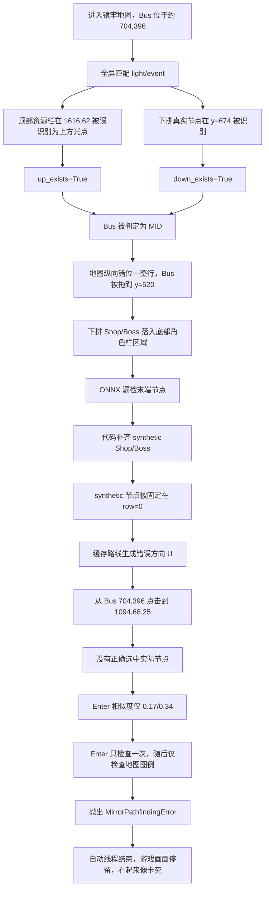

# 镜牢寻路卡死根因与分支实现对比

## 1. 文档目的

本文整理镜牢寻路停留在末端节点或 `Enter` 界面的问题，包括：

- 完整日志和 ONNX 诊断数据中的故障证据；
- Bus 所在行误判的根本原因；
- 错误从 Bus 行判断传播到最终点击失败的完整流程；
- 各分支对镜牢寻路逻辑的修改及差异；
- 后续合并和验证建议。

本文只记录分析结论，不包含代码修改。

## 2. 分析数据范围

本次分析使用项目 `logs` 目录中的完整数据：

| 数据 | 数量 |
| --- | ---: |
| 轮转调试日志 `debugLog*` | 9 |
| ONNX 地图 JSON `onnx_map_*.json` | 119 |
| ONNX 路线 JSON `onnx_route_*.json` | 119 |
| ONNX 节点截图 `onnx_nodes_*.png` | 395 |
| MuMu 截图超时 | 85 |

日志覆盖时间约为 2026-08-07 22:18 至 2026-08-08 10:51。

日志中共有三次明确的：

```text
MirrorPathfindingError: 无法确认已进入镜牢节点
```

分别发生在第一层普通战斗、第四层商店和第五层最终 Boss。

## 3. 根本原因

末端节点卡死的根本原因是：

> `find_bus()` 使用全屏 `light/event` 模板匹配结果判断 Bus 所在行，顶部资源栏被误识别为地图光点，导致实际位于 `UP` 的 Bus 被判断为 `MID`。

后续虚拟节点行错误和 Enter 单次检测都是下游放大因素，不是最初根因。

### 3.1 直接证据

第四层失败前的日志：

```text
Bus: (704,396)
light: [(1126,674), (1616,62), (1894,674)]
event: 未找到
```

其中 `(1616,62)` 位于顶部资源栏，不是地图节点，但被 `light.png` 模板识别。

当前判断代码使用：

```python
up_exists = any(y < bus_y - Y_GAP * scale / 2 for _, y in visible_positions)
down_exists = any(y > bus_y + Y_GAP * scale / 2 for _, y in visible_positions)

if up_exists == down_exists:
    bus_row = Position.MID
elif up_exists:
    bus_row = Position.DOWN
else:
    bus_row = Position.UP
```

顶部假光点使 `up_exists=True`，下方真实节点使 `down_exists=True`，最终进入 `MID` 分支。

### 3.2 纵向误差

当前运行分辨率高度为 1080，参考高度为 1440：

```text
scale = 1080 / 1440 = 0.75
Y_GAP = 437 * 0.75 = 327.75
```

Bus 初始 Y 坐标约为 396：

```text
误判 MID 后目标 Y = 700 * 0.75 = 525
正确 UP 后目标 Y = 525 - 327.75 = 197.25
```

两者相差约 `327.75` 像素，正好是一整行。

Bus 被放到错误的中行后，下排节点落到约 `848—877` 的位置，与底部角色头像栏重叠，导致 ONNX 漏检 Shop 或 Boss。

## 4. 完整故障流程



## 5. 三次明确失败

| 时间 | 楼层/目标 | 路线 | 点击 | 结果 |
| --- | --- | --- | --- | --- |
| 2026-08-07 22:32 | 第一层普通战斗 | `M` | `(494,523)` | 坐标基本正确，但节点点击或过渡未确认，且没有重试 |
| 2026-08-08 04:28 | 第四层商店 | `D → U → M` | `(1094,68.25)` | Bus 行误判后 Shop 漏检，产生错误的 `U` |
| 2026-08-08 08:07 | 第五层最终 Boss | `M → M → D → U` | `(1094,68.25)` | Boss 漏检并被补到错误行，最终方向应接近 `M` 而不是 `U` |

相关证据：

- `logs/debugLog.log.2:8548-8556`：第四层 Bus、光点和错误路线；
- `logs/debugLog.log.2:9377-9396`：第四层错误点击与异常；
- `logs/debugLog.log.1:7509-7519`：第五层 Bus、光点和路线；
- `logs/debugLog.log.1:8846-8865`：第五层错误点击与异常；
- `logs/onnx_nodes_1786134397118905600.png`：第四层 ONNX 截图；
- `logs/onnx_nodes_1786147543766293900.png`：第五层 ONNX 截图；
- `logs/onnx_map_1786147543766293900.json`：第五层 Boss 被标记为 `synthetic`。

## 6. 下游放大因素

### 6.1 虚拟末端节点固定为中行

`mirror2` 的 `_append_shop_and_boss()` 在缺少真实末端节点时，将 Shop 和 Boss 固定创建在 `row=0`。

当实际末端位于上排或下排时，会错误生成 `U` 或 `D`。正确行为应当至少让 Boss 继承 Shop 的行。

### 6.2 Enter 只确认一次

`mirror2` 的节点进入流程：

1. 点击计算出的下一节点；
2. 固定等待 1.25 秒；
3. 仅识别并点击一次 Enter；
4. 检查三次地图图例；
5. 仍在地图时直接抛出异常。

因此任何一次错误方向、点击丢失或界面延迟都会终止当前自动线程。

### 6.3 MuMu 截图超时

完整日志中有 85 次 MuMu 截图超时，但三次进入失败附近没有直接截图超时记录。因此截图延迟是概率放大因素，不是本次末端节点故障的直接根因。

## 7. 寻路分支实现对比

对所有本地分支和 `origin/*` 的 `tasks/mirror/search_road.py` 进行 blob 比较后，共发现 14 个不同文件版本，但主要可以归纳为七种寻路架构。

| 分支族 | Bus 行判断 | 节点与路线识别 | 进入确认 | 主要差异 |
| --- | --- | --- | --- | --- |
| `main` 系 | 根据一次 ONNX 的节点 Y 分组判断，必要时移动后再识别一次 | ONNX 节点 + 线段/模板路线 + Dijkstra | 坐标点击，失败后点击 Bus | 传统完整路线图方案，代码较大 |
| `road` 系 | 与 `main` 基本一致 | 使用 `up/mid/down` 模板替换 LSD 线段确认连线 | 同 `main` | 连线识别更稳定，部分分支保存 ONNX 截图 |
| `ui` | 与 `main` 类似 | 增加四列全图路线、Watchdog 和分析记录 | 坐标点击 + Bus 兜底 | 偏向调试、性能和可视化 |
| `origin/speed` | 一次全屏 `light/event` 判断 | 寻路拆到 `road_map.py`，ONNX + 模板 + Dijkstra | 坐标点击 + Bus 兜底 | 增加卡包、队伍、楼层和节点耗时上下文 |
| `origin/mirror` | 一次全屏 `light/event` 判断 | 精简 Node 图，ONNX 一次，缺失末端自动补齐 | 等待 Enter/Event，并有首连线兜底 | 新式精简方案的早期版本 |
| `ui_temp_temp` | **UP/MID/DOWN 三位置分别执行 ONNX，选择节点最多的位置** | 绝对 Bus 行构图，缓存并更新 Bus 行 | Enter 检测失败后点击当前 Bus；支持首方向兜底 | Bus 行处理最完整，Boss 继承 Shop 行 |
| `mirror2` | 一次全屏 `light/event` 判断 | 精简 Node 图；保存地图/路线 JSON 和多张诊断截图 | 固定等待后单次 Enter；失败抛异常 | 诊断最完整，但 Bus 行和进入确认发生回退 |

### 7.1 传统 `main` 分支族

以下分支底层寻路架构基本相同：

```text
main
fix
normal2hard
origin/normal2hard
origin/revert-837-node
origin/main
origin/fix
origin/node
origin/codex/theme-pack-switch-wait
kw
origin/image
origin/theme
origin/ui_temp
origin/refactor/code-optimization
```

细节差异：

- `kw`：较早加入键盘方向寻路；
- `origin/ui_temp`：调整楼层刷新和缓存清理；
- `origin/node`：更新节点名称和权重；
- `normal2hard`：`search_road.py` 与 `main` 相同，主要变化不在寻路算法本身。

### 7.2 `road` 分支族

```text
road
codex/road-rebuild-20260805
origin/road
```

主要变化：

- 用局部 `up/mid/down` 模板确认节点之间的连线；
- `codex/road-rebuild-20260805` 与 `origin/road` 代码相同；
- 本地 `road` 与它们只有一处实质差异：没有保存 ONNX 输入截图。

### 7.3 调试和记录分支

```text
ui
origin/ui
origin/record
origin/speed
```

- `ui`：在传统架构上增加四列完整地图、路线尝试、耗时和失败记录；
- `origin/record`：记录每个节点类型和耗时，并将主要节点权重统一；
- `origin/speed`：把图构建移动到独立 `road_map.py`，保存节点运行上下文。

### 7.4 新式精简分支

```text
origin/mirror
ui_temp_temp
origin/ui_temp_temp
mirror2
origin/mirror2
```

这些分支虽然都使用精简 Node 图，但 Bus 行策略不同：

- `origin/mirror`：一次模板判断；
- `ui_temp_temp`：三位置 ONNX 探测；
- `mirror2`：重新回到一次模板判断，同时增加大量诊断日志。

`ui_temp_temp` 和 `origin/ui_temp_temp` 指向同一提交：

```text
f5ab1e24 Refactor search_road tests and enhance functionality
```

三位置探测最初由以下提交引入：

```text
01103ff5 feat: 重构寻路
```

## 8. 建议的合并方向

不建议将 `mirror2` 整体回退到其他分支。较合理的方案是保留 `mirror2` 的诊断能力，同时移植 `ui_temp_temp` 中已经实现的 Bus 行逻辑。

### 8.1 建议从 `ui_temp_temp` 移植

- `BUS_PROBE_ORDER` 和候选优先级；
- `find_bus(bus_row=None)` 三位置 ONNX 探测；
- `MirrorMap.bus_row` 状态保存；
- 成功进入节点后的 Bus 行更新；
- 使用绝对 Bus 行构建逻辑网格；
- Boss 继承 Shop 行，保证 `shop → boss` 为 `M`；
- ONNX 失败时的首条连线方向兜底。

### 8.2 建议保留 `mirror2`

- 更新后的节点名称和路线权重；
- `onnx_map_*.json` 和 `onnx_route_*.json`；
- ONNX 输入截图和横向移动诊断截图；
- 简单键盘寻路兜底；
- 明确的 `MirrorPathfindingError` 异常传播。

### 8.3 建议额外修复

- Enter 确认改为有超时的循环，而不是固定等待后单次检测；
- 节点点击失败时不要消费路线缓存；
- 超时前重复检测 Enter/Event/页面离开状态；
- 日志记录本次 Bus 行、每个候选位置的节点数和最终选择理由。

## 9. 建议验证用例

1. 顶部资源栏产生 `light.png` 假阳性、真实节点只在 Bus 下方时，应选择 `UP`。
2. Bus 行未知时，必须分别执行 UP/MID/DOWN 三次 ONNX。
3. 三次节点数量相同时，按既定规则优先选择 `MID`。
4. 已知 Bus 行时只执行一次 ONNX，不重复三位置探测。
5. 成功进入 `U/M/D` 节点后，缓存中的 Bus 行应同步更新。
6. 合成 Boss 必须继承对应 Shop 行。
7. 节点点击或 Enter 确认失败时，不得消费缓存路线。
8. Enter 延迟出现时，应在超时窗口内再次检测并点击。
9. 失败日志必须包含 Bus 原坐标、判定行、三个候选节点数、方向和点击坐标。

## 10. 分支查看命令

查看三位置探测实现：

```powershell
git show ui_temp_temp:tasks/mirror/search_road.py
```

比较当前 `mirror2`：

```powershell
git diff mirror2..ui_temp_temp -- tasks/mirror/search_road.py
```

查看全部本地和远程跟踪分支：

```powershell
git branch -a
```

## 11. 最终结论

当前末端节点卡死的完整因果关系为：

> 顶部 UI 假光点导致 Bus 行误判 → 地图纵向错位一整行 → 下排末端节点被底部 UI 遮挡 → ONNX 漏检 Shop/Boss → synthetic 节点行错误 → 产生错误 U/D 方向 → 点击错误坐标 → Enter 无法确认 → 自动线程异常结束。

`ui_temp_temp` 是当前仓库中唯一通过三位置 ONNX 探测判断 Bus 行的分支，也是修复 `mirror2` Bus 行问题最直接的参考实现。
