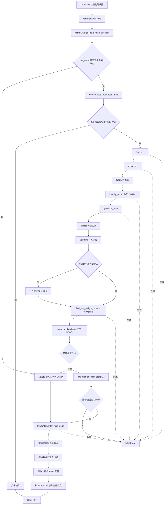

# 镜牢纯 ONNX 寻路流程

## 模块职责

- `Mirror.search_road`：寻路总入口，统一把异常转换为 `False`。
- `MirrorMap`：保存当前楼层完整节点图和包含 bus 的最优节点路线。
- `search_road_from_road_map`：组织一次完整的 ONNX 寻路。
- `find_bus` / `move_bus` / `onnx`：定位并归一化地图，识别节点。
- `generate_map`：网格化节点、识别连线，普通镜牢补齐商店和 BOSS。
- `find_min_weight_route` / `route_to_directions`：计算最低权重路线并转换为 U/M/D。

## 调用流程

## 失败策略

当 `floor_route` 不足两个节点时重新执行 ONNX。ONNX 识别、bus 定位、建图或
最低权重路线计算未生成有效路线时，不保存路线缓存，而是使用当前 bus 坐标调用
`find_first_direction` 识别首个可用方向。只有 ONNX 和首方向识别均失败时才返回
`False`。不再使用 watchdog，也不回退到最近节点法或滚轮寻路。

缓存路线仅在成功进入节点后移除当前节点。直接识别的方向不写入 `floor_route`，
因此执行完毕后，下一次调用仍会优先重新执行 ONNX。

## 独立方向探测

`find_first_direction(bus_position)` 保持为独立函数，由 `MirrorMap` 在 ONNX
没有得到有效路线时调用。它根据 bus 坐标计算 bus 到上、中、下三个相邻节点的
连线中点，并依次匹配 `up_arr.png`、
`mid_arr.png`、`down_arr.png`。函数返回第一个命中的 `U`、`M` 或 `D`；三个
方向均未命中时返回 `False`。
